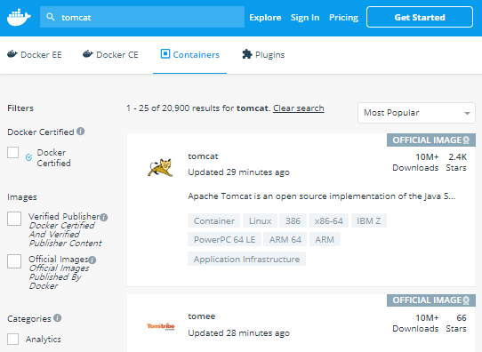

이 글은 docker 의 기본적인 명령어들을 사용하여 컨테이너를 조작해본다.

### 💡 docker repository 에서 image 검색
> ##### `NAME` 에 `/` 앞에 이름이 없는 것이 __official image__

```sh
$ sudo docker search tomcat
NAME              DESCRIPTION                                     STARS               OFFICIAL            AUTOMATED
tomcat            Apache Tomcat is an open source implementati…   2446                [OK]                
tomee             Apache TomEE is an all-Apache Java EE certif…   66                  [OK]                
dordoka/tomcat    Ubuntu 14.04, Oracle JDK 8 and Tomcat 8 base…   53                                      [OK]
bitnami/tomcat    Bitnami Tomcat Docker Image                     28                                      [OK]
```

- [Docker hub](https://hub.docker.com) 에서 검색해도 된다. 



---

### 💡 docker image 내려받기
  - 등록되어 있는 docker repository 에서 image 를 내려 받는다. (default: hub.docker.com)
  - tag를 명시하지 않으면 자동으로 latest 버전을 내려 받는다.

```sh
$ sudo docker pull tomcat
Using default tag: latest
latest: Pulling from library/tomcat
6f2f362378c5: Downloading [======>                                            ]  5.975MB/45.34MB
```

---

### 💡 docker image 조회하기
  - pull, build, load 등으로 로컬에 저장된 docker image 들을 조회한다.
  - `-a` 옵션은 모든 이미지를, `-q` 옵션은 __IMAGE ID__만 조회한다.

```sh
$ sudo docker images (-a -q)
REPOSITORY            TAG                 IMAGE ID            CREATED             SIZE
tomcat                latest              7123ec940c88        4 days ago          510MB
nginx                 v1                  0a9399390b8a        32 hours ago        109MB
```

---

### 💡 docker image 삭제하기
* image 한건 삭제
```sh
$ sudo docker rmi <IMAGE ID>
```
* image 전부 삭제 (-a -q 옵션으로 모든 __IMAGE ID__ 조회 후 삭제)
```sh
$ sudo docker rmi $(sudo docker images -a -q)
```

---

### 💡 docker manifest 확인 (layer 체크)

```sh
$ sudo docker inspect tomcat
```

---

### 💡 docker 컨테이너 실행

```sh
$ sudo docker run -d [image name]
// -d 옵션을 주면 백그라운드에서 컨테이너를 실행한다.

$ sudo docker run -t -p [외부_ip]:[내부_ip] tomcat
// -p 옵션을 주어 포트포워딩해주어야 docker 외부에서 접근 가능하다.
```
---

### 💡 docker 컨테이너 조회 

```sh 
$ sudo docker ps
CONTAINER ID        IMAGE                    COMMAND                  CREATED             STATUS              PORTS                                              NAMES
f5566a13cf94        dc2664e1f5f6             "catalina.sh run"        32 hours ago        Up 32 hours         0.0.0.0:8080->8080/tcp                             tomcat

$ sudo docker ps -a -q
f5566a13cf94
// -a 옵션: 실행/비실행 모두 조회, -q: id만 조회
```

---

### 💡 docker 컨테이너 모두 stop 및 삭제

```sh
$ sudo docker stop $(docker ps -a -q) // docker 컨테이너 모두 정지
$ sudo docker rm $(docker ps -a -q) // docker 컨테이너 모두 삭제
```

---

### 💡 docker 컨테이너의 shell 접속 (it 옵션을 주어야 터미널 접속 가능)
- __i__: interacive 모드
- __t__: tty 모드

```sh 
$ sudo docker exec -it [container_id] /bin/bash
```

---

### 💡 docker 컨테이너 시작 및 중지

```sh
$ sudo docker start <CONTAINER_ID>
// CONTAINER_ID 의 docker container 시작
```