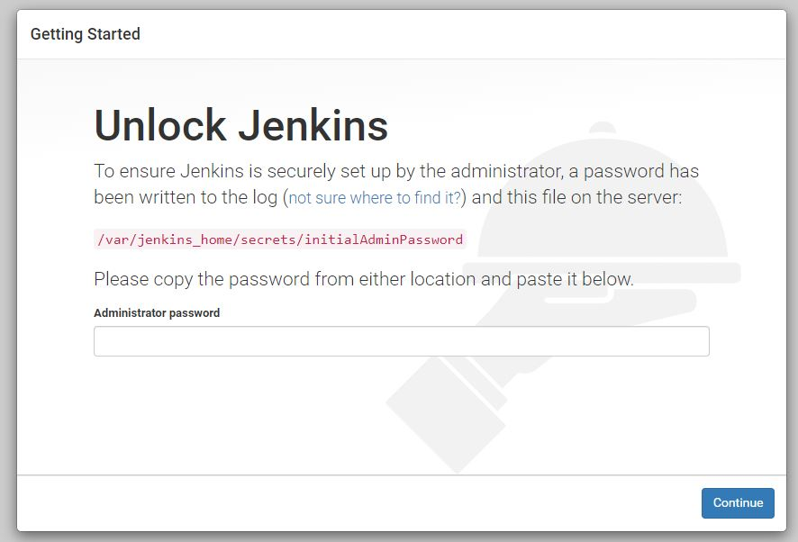
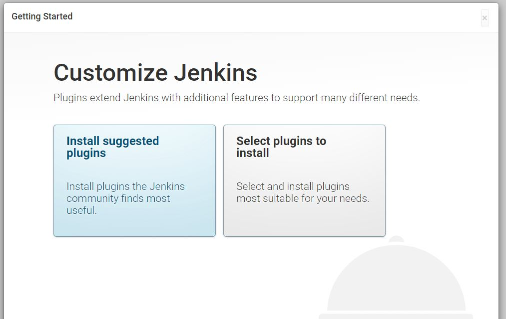

이 글에서는 CI/CD 툴인 jenkins docker 이미지를 pull 받아 docker 컨테이너 형태로 띄워본다. __Dockerfile__ 을 작성하여 커스터마이징 된 이미지를 띄우는 것은 다음 포스팅 [docker 이미지 빌드 및 배포](/docker/04.docker-이미지-빌드-및-배포/)에서 진행한다.

1. 먼저 jenkins 이미지를 검색한다.

```sh
$ sudo docker search jenkins
NAME            DESCRIPTION                               STARS    OFFICIAL   AUTOMATED
jenkins         Official Jenkins Docker image             4327     [OK]                
jenkins/jenkins The leading open source automation server 1563                                
```

2. docker 공식 publishing 이미지인 jenkins 를 내려 받는다.

```sh
$ sudo docker pull jenkins
Using default tag: latest
latest: Pulling from library/jenkins
55cbf04beb70: Extracting [====================>                              ]  18.81MB/45.31MB
1607093a898c: Download complete
9a8ea045c926: Download complete
d4eee24d4dac: Downloading [===============================================>   ]  47.32MB/50.06MB
c58988e753d7: Download complete
794a04897db9: Waiting
...
...
...
Status: Downloaded newer image for jenkins:latest
```
3. jenkins image가 잘 내려받아졌는지 확인하고,

```sh
$ sudo docker images
REPOSITORY            TAG                 IMAGE ID            CREATED              SIZE
jenkins               latest              cd14cecfdb3a        15 seconds ago       696MB
```


3. jenkins image 를 실행한다.
> it 옵션 외에 p 옵션을 추가로 주어 도커 외부에서 접속가능하도록 포트포워딩해준다. __8080__ -> __8080__
> d 옵션을 추가로 달면, 백그라운드에서 docker 가 돌아간다. (이 때 로그를 확인하려면 `sudo docker logs <jenkins_container_id>`)

```sh
$ sudo docker run -it -p 8080:8080 -d jenkins
763b9b0e1a142d78c13052b1979f182ceec21648df3abe5b15a47ee3336f1c0d
```

4. jenkins 컨테이너가 정상적으로 띄워졌는지 로그로 확인한다. 
> 위 3번 단계에서 d 옵션을 뺐다면, 로그가 `run` 명령어 하단에 바로 쌓인다.

```sh
$ sudo docker ps
CONTAINER ID   IMAGE    COMMAND                  CREATED             STATUS           PORTS      
763b9b0e1a14   jenkins  "/bin/tini -- /usr..."   12 minutes ago      Up 12 minutes    50000/tcp, 0.0.0.0:8080->8080/tcp

$ sudo docker logs 763b9b0e1a14
Running from: /usr/share/jenkins/jenkins.war
webroot: EnvVars.masterEnvVars.get("JENKINS_HOME")
...
...
...
INFO: Obtained the updated data file for hudson.tools.JDKInstaller
Jul 13, 2019 9:41:55 AM hudson.model.AsyncPeriodicWork$1 run
INFO: Finished Download metadata. 8,519 ms
```

4. http://localhost:8080 를 열어 jenkins에 접속되는지 확인한다.

> Linux 환경이라 브라우저가 없어 확인이 어렵다면, `curl localhost:8080` 명령으로 html 내용을 확인한다.

```sh
$ curl localhost:8080
<html><head><meta http-equiv='refresh' content='1;url=/login?from=%2F'/><script>window.location.replace('/login?from=%2F');</script></head><body style='background-color:white; color:white;'>


Authentication required
<!--
You are authenticated as: anonymous
Groups that you are in:

Permission you need to have (but didn't): hudson.model.Hudson.Administer
-->

</body></html>     
```

5. 처음 jenkins 를 들어가면 initPassword 를 입력하라고 나온다.
> _This may also be found at:_ __/var/jenkins_home/secrets/initialAdminPassword__

접속을 위해선 비밀번호를 입력해야하는데, 이 비밀번호는 docker 로 접속하여 확인해야한다. 아래 명령을 입력하여 비밀번호를 확인하자.

```sh
$ sudo docker exec 763b9b0e1a14 cat /var/enkins_home/secrets/initialAdminPassword
2cfd75e9b5ba49dfae3344d34542cac4
```

> 혹은 jenkins 로그에서 비밀번호를 확인할 수도 있다.
```sh
$ sudo docker logs 763b9b0e1a14
...
Jenkins initial setup is required. An admin user has been created and a password generated.
Please use the following password to proceed to installation:

2cfd75e9b5ba49dfae3344d34542cac4
...
```

비밀번호를 입력하면 아래 그림처럼 화면이 나오고 jenkins 가 사용 가능하다.



### 마무리
하지만 이렇게 생성한 jenkins 컨테이너에서 job을 생성하고 실행하면 __일단은 잘 돌아갈 것이다.__

하지만 컨테이너를 재시작한다면 생성했던 job들은 모두 사라지고, 위에서 했던 초기비밀번호 설정부터 다시해야한다. 그 이유는, 도커 컨테이너는 항상 새로운 상태로 시작되기 때문이다.

이 문제를 해결하기 위해서 영구적으로 보존해야 할 데이터들은 도커 외부에 있는 실제 파일시스템을 마운팅해줘야한다. 이에 대한 방법 및 내용은 [docker 이미지 빌드 및 배포](/docker/04.docker-이미지-빌드-및-배포/)에서 설명할 예정이다. 


