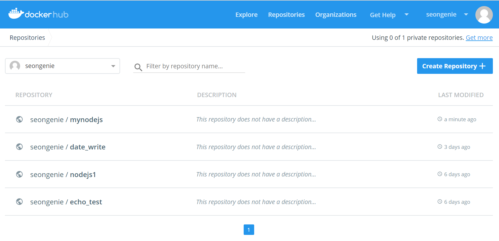

이번 포스팅에서는 Dockerfile 을 작성하여 이미지를 빌드하고 배포하고, 또 실행까지 해본다. 사용할 베이스 이미지는 __node__ 다. 예제로 node 를 통해 간단한 응답을 해주는 서버를 만들고 컨테이너로 띄워본다.

---

#### 먼저 Dockerfile에 사용할 수 있는 명령어를 알아보자.
<br/>
<div>
    <table>
        <thead>
            <tr>
                <th>Instruction</th>
                <th style="width:60%">Description</th>
                <th>Example</th>
            </tr>
        </thead>
        <tbody>
            <tr>
                <td><strong>FROM</strong></td>
                <td>Base 될 이미지 이름을 지정, 주로 busybox나 alpine 리눅스 같은 경량 OS를 지정하게 된다. Base 이미지를 지정할때는 ubuntu:16.04 처럼 OS와 버전까지 지정하는 것이 좋다.</td>
                <td><pre>FROM ubuntu:16.04</pre></td>
            </tr>
            <tr>
                <td><strong>RUN</strong></td>
                <td>shell 명령어를 docker 이미지에 실행시킬때 사용한다. 예를 들어 start.sh 의 권한을 755로 변경하고 싶다면 예시처럼 하면 된다.
                <td><pre>RUN chmod 755 start.sh</pre></td>
            </tr>
            <tr>
                <td><strong>ADD</strong></td>
                <td>파일 및 디렉토리를 host에서 docker image 내부 file system로 copy한다. ADD 할려고 하는 디렉토리가 image에 없으면, docker가 자동으로 생성한다. 생성된 디렉토리는 755 mod와 0 UID & GID로 생성된다. 또 ADD 하려는 파일이 tar 압축파일 이면 docker가 자동으로 압축을 풀고 ADD 한다.</td>
                <td><pre>ADD start.sh /bin/start.sh</pre></td>
            </tr>
            <tr>
                <td><strong>COPY</strong></td>
                <td>ADD와 동일하나 URL을 지정할수 없고 압축파일을 자동으로 풀어주지 않는다. (ADD, COPY 할 파일은 빌드할 docker 이미지의 디렉토리에 존재해야한다.)</td>
                <td><pre>COPY start.sh /bin/start.sh</pre></td>
            </tr>
            <tr>
                <td><strong>CMD</strong></td>
                <td>CMD를 사용하여 docker container가 시작할때 실행할 커맨드를 지정할수 있다. RUN instruction 과 기능은 비슷하지만 차이점은 CMD는 docker image를 빌드할때 실행되는 것이 아니라 docker container가 시작될때 실행된다는 것이다. 주로 docker image로 빌드된 application을 실행할때 쓰인다</td>
                <td><pre>RUN ["sh", /bin/start.sh]</pre></td>
            </tr>
        </tbody>
    </table>
</div>
<br/>

#### 이제 위 Instruction 을 가지고 간단한 docker 이미지를 생성하자. 예시로 nodejs 를 이용하여 요청에 응답해주는 서버를 만들도록 한다.

app.js 이름을 가진 간단한 nodejs 서버파일을 작성하자.
```js
// app.js
const http = require('http');

console.log('Nodejs server starting...');
http.createServer((request, response) => {
    response.writeHead(200, {'Content-Type' : 'text/plain'});
    response.write('Hello docker!');
    response.end();
}).listen(8080);
```

아래 명령어를 실행하여 디렉토리를 만들고 만든 app.js 를 만든 디렉토리로 옮긴다.

```sh
mkdir nodejs
mv app.js nodejs/.
cd nodejs
```

Dockerfile 을 작성한다.
```sh
# Dockerfile
FROM node

COPY app.js /app.js

CMD ["node", "/app.js"]
```
절차대로 했다면 디렉토리 안에는 __app.js__ 와 __Dockerfile__ 두개만 존재한다.
```sh
~/nodejs$ ls
app.js  Dockerfile
```

이제 빌드 명령어로 이미지를 빌드해보자.
> `docker build -t <USERNAME>/<IMAGE_NAME>:<TAG> .` _<>_ 안에는 원하는 값을 넣으면 된다.
```sh
$ docker build -t seongenie/mynodejs:v1 .
Sending build context to Docker daemon  3.072kB
Step 1/3 : FROM node
latest: Pulling from library/node
a4d8138d0f6b: Pull complete
dbdc36973392: Pull complete
f59d6d019dd5: Pull complete
aaef3e026258: Pull complete
6e454d3b6c28: Pull complete
c717a7c205aa: Pull complete
e8566b4564fe: Pull complete
04239395be03: Pull complete
27ace7d95321: Pull complete
Digest: sha256:6e64f63a663a368cc81b28ed3c3e29e6b3784c04f0128be5aaa659157ed4d231
Status: Downloaded newer image for node:latest
 ---> 7c412a558705
Step 2/3 : COPY app.js /.
 ---> c3e8077301b6
Removing intermediate container 36ef574f13b3
Step 3/3 : CMD ["node", "/app.js"]
 ---> Running in 134f78e48274
 ---> fc4507a04bec
Removing intermediate container 134f78e48274
Successfully built fc4507a04bec
Successfully tagged seongenie/mynodejs:v1
```
위에서 docker 이미지가 만들어졌다는 로그 확인 후, 실제로 잘 만들어졌는지 확인해보자.
먼저 `docker images` 명령을 통해 이미지가 실제로 존재하는지 확인한다.

```sh
$ docker images
REPOSITORY            TAG                 IMAGE ID            CREATED             SIZE
seongenie/mynodejs    v1                  fc4507a04bec        3 minutes ago       907MB
```

이미지가 실제로 만들어진 것을 확인했으면 `docker run <IMAGE>` 명령을 통해 컨테이너로 띄워보자.
> -it, -d -p 옵션을 주어 이미지를 띄운다. (터미널 접속, 백그라운드, 포트포워딩 옵션)
```sh
$ docker run -it -d -p 8080:8080 seongenie/mynodejs:v1
ef444accabb4990bfd547a4d0b17bb53584af714b08247687d85e26543a3112c

$ docker ps
CONTAINER ID        IMAGE                    COMMAND                  CREATED             STATUS              PORTS                       ef444accabb4        seongenie/mynodejs:v1    "docker-entrypoint..."   12 seconds ago      Up 11 seconds       0.0.0.0:8080->8080/tcp      
```
`docker ps` 명령을 통해 컨테이너가 잘 띄워져있는 것까지 확인했으면, 이제 정상적으로 동작하는지 테스트해보자. `curl localhost:8080` 명령을 실행하여 응답이 제대로 오는지 보자.
```sh
$ curl localhost:8080
Hello docker!
```
_Hello docker!_ 로 응답이 의도한대로 오는 것을 확인할 수 있다.
확인했으면 docker 컨테이너 프로세스를 내리고 push 까지해보자.
```sh
sudo docker stop ef444accabb4  # docker ps 에서 확인한 컨테이너 ID
```
이미지를 내린 후에 `docker push <IMAGE>` 를 실행하면 이미지를 올릴 수 있다. 먼저 docker 로그인이 되지 않은 상태라면 `docker login` 명령을 통해 로그인 시켜주자.
_username_과 _password_를 입력하면 로그인이 된다. 
> 아이디가 없다면 https://hub.docker.com 에서 아이디를 미리 만들고 로그인하면 된다.
```sh
$ docker login
Login with your Docker ID to push and pull images from Docker Hub. If you don't have a Docker ID, head over to https://hub.docker.com to create one.
Username : seongenie
Password:
Login Succeeded
```

로그인까지 됐으면 `docker push` 명령으로 이미지를 리파지토리에 올린다.
```sh
$ docker push seongenie/mynodejs:v1
The push refers to a repository [docker.io/seongenie/mynodejs]
971797ec7533: Preparing
ae68533976d5: Preparing
...
...
...
e2a8a00a83b2: Mounted from library/node
v1: digest: sha256:1da244582e300794099b40fef1d434e90917965248f64bd8bd3f3d7e51f8af0b size: 2422
```
위처럼 나왔다면 push 가 된 것이다. https://hub.docker.com 에서 이미지가 제대로 push 됐는지 확인할 수 있다. <br/><br/>

이렇게 올라간 이미지는 `docker pull` 명령을 통해 내려받을 수 있다.